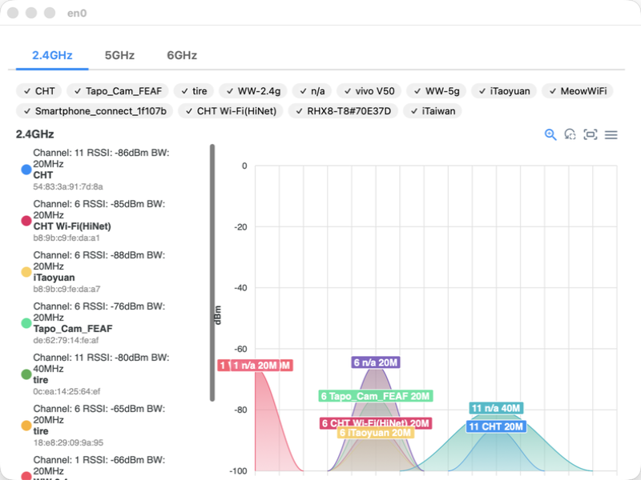

# Tiny Wi-Fi Analyzer

> Forked from [nolze/tiny-wifi-analyzer](https://github.com/nolze/tiny-wifi-analyzer)

Simple, open-source Wi-Fi channel and strength analyzer for macOS.
Made with PyObjC, pywebview, ApexCharts, PyInstaller.



## Features

* Real-time updates of Wi-Fi networks
* Support for 2.4 GHz, 5 GHz, and 6 GHz Wi‑Fi bands
* Highlight the chart for the selected SSID
* Export charts as images (PNG, JPEG, or SVG)
* Export chart data as a CSV file

## Improvements over upstream

* **Tab-based band switching** — 2.4G / 5G / 6G bands displayed as underline-style tabs instead of vertically stacked charts, with lazy chart rendering on first data arrival
* **Stable SSID colors** — global BSSID-to-color mapping with a 30-color palette ensures each network keeps its color across scan cycles
* **SSID filter panel** — checkbox chip bar to show/hide specific SSIDs; filter state persists across tab switches and applies to all bands
* **Bandwidth display** — channel width (e.g. 80MHz) shown in both the legend and data labels on the chart
* **Correct channel width from CoreWLAN** — converts `CWChannelWidth` enum values to actual MHz, fixing both triangle span calculation and displayed bandwidth
* **Reduced grid density** — switched x-axis from category to numeric type so `tickAmount` controls grid lines, eliminating the 233-line wall on 6 GHz
* **Deferred empty-band rendering** — charts for bands with no detected networks stay in placeholder state instead of rendering an empty chart frame
* **Dynamic chart initialization** — `window.init(bands)` creates only the tabs and charts for bands the system actually supports
* **Location Services dialog** — added an "Ignore" button for the macOS 14+ Location Services permission prompt

## Requirements

* macOS 10.15 (Catalina) or later (may work in 10.14 and earlier)

## Download

[Visit the latest release](https://github.com/sssuperman/tiny-wifi-analyzer/releases/latest/)

### Important notes

Because the application is not signed, you will need to follow the steps below in order to run the application.

1. **Right-click on the app icon**,
2. select "Open" from the context menu, and
3. select "OK" in the dialog below.\
   

On macOS 14 Sonoma and later, Location Services permission is required to get Wi-Fi SSIDs.
Please enable Location Services by following the instructions.


## Todos

* [x] Bundle scripts with Parcel
* [x] Prepare GitHub Pages

## Mentions

- [Bezplatné macOS aplikace, které stojí za pozornost [Free macOS apps worth paying attention to] – Jablíčkář.cz](https://jablickar.cz/bezplatne-macos-aplikace-ktere-stoji-za-pozornost-stredove-tlacitko-prepinani-aplikaci-a-virtualizace/4/)
- [What are your favourite open-source apps? : r/macapps](https://www.reddit.com/r/macapps/comments/140bl4x/comment/jmx1o5g/)
- [„Breitbandmessung Desktop“ aktualisiert – „Tiny Wi-Fi Analyzer“ neu › ifun.de](https://www.ifun.de/breitbandmessung-desktop-aktualisiert-tiny-wi-fi-analyzer-neu-248571/)

## Develop

```sh
git clone https://github.com/sssuperman/tiny-wifi-analyzer
cd tiny-wifi-analyzer
poetry install
poetry run python -m tiny_wifi_analyzer

# Frontend
pnpm install
pnpm run watch # or pnpm run build

# Packaging
make build
```

## License

```
Copyright 2020 nolze

Licensed under the Apache License, Version 2.0 (the "License");
you may not use this file except in compliance with the License.
You may obtain a copy of the License at

   http://www.apache.org/licenses/LICENSE-2.0

Unless required by applicable law or agreed to in writing, software
distributed under the License is distributed on an "AS IS" BASIS,
WITHOUT WARRANTIES OR CONDITIONS OF ANY KIND, either express or implied.
See the License for the specific language governing permissions and
limitations under the License.
```
